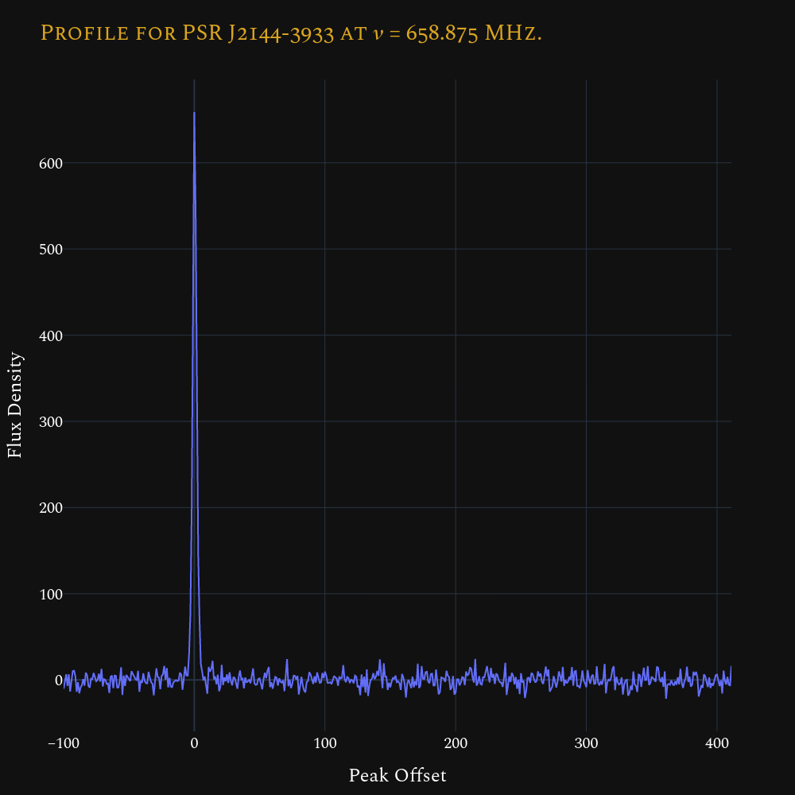

<div style="font-family:JetBrainsMono Nerd Font">

![License][license-badge]
[![Gitmoji][gitmoji-badge]][gitmoji]
[![Code style: black][black-badge]][black]
[![Interrogate][interrogate-badge]][interrogate]

<div align="justify">

## What is this?

[**`epndb`**][epndb] allows access to the EPN's Database of Pulsar Profiles, via
Python. Begun as a part of the **E**uropean **P**ulsar **N**etwork (**EPN**) in
1996, the aim of this database was to form a large collection of pulsar
profiles, and provide them via a simple and convenient web interface. In 2015,
Michael Keith recreated a modern version of the database, which is now housed
[**here**][epnweb]. This project aims to provide a Pythonic interface to the
database, allowing for many of the same features as the original database, while
also adding new ones. Some of these features are:

- Search for a pulsar(s) in the database,
- Get info about a pulsar's profiles,
- Get a profile as a [`numpy`][numpy] array,
- Plot, and interact with, a profile (via [`plotly`][plotly]),
- Save a profile in various formats, such as:
  - HDF5,
  - JSON,
  - ASCII,
  - PSRFITS, etc.

## Install

Installation is as simple as:

```bash
pip install epndb
```

## Usage

```ipython
In [1]: from epndb import DB

In [2]: psr = DB.get("J2144-3933")

In [3]: psr.profiles
Out[3]:
[Profile for PSR J2144-3933 at 𝜈 = 436.0 MHz.,
 Profile for PSR J2144-3933 at 𝜈 = 436.0 MHz.,
 Profile for PSR J2144-3933 at 𝜈 = 658.875 MHz.,
 Profile for PSR J2144-3933 at 𝜈 = 1369.0 MHz.,
 Profile for PSR J2144-3933 at 𝜈 = 1400.0 MHz.,
 Profile for PSR J2144-3933 at 𝜈 = 1520.0 MHz.]

In [4]: prof = psr.profiles[2]

In [5]: prof.plot()
```

This should show something like this:

<br/>
<div align="center">

</div>
<br/>

but interactive, right in your favourite web browser! (**Note**: This does not
mean that you require the internet to plot the profile. However, you do need it
to access the profile!)

## Licensing

This project is entirely my own, and is not associated with the database, or the
organisations maintaining it (the Jodrell Bank Pulsar Group at the University of
Manchester, and the European Pulsar Timing Array (EPTA)). The code is licensed
under the MIT License. The data is copyrighted to the authors of the work that
produced the profiles. Most of the data is licensed under one of two license:
the EPN Legacy Agreement, or the CC Attribution 4.0 International License. Some
of the data may be under other licenses. If in doubt, make sure to contact the
original authors of the work!

### EPN Legacy Agreement

> The data that form this archive have been, or will shortly about to be,
> published in Scientific journals. The authors have kindly agreed to make their
> data available publicly. Therefore, if you intend to use any of the data as
> part of a publication, full credit MUST be given to the original authors.
> Specific information on the data for each profile can be found in the main
> archive browser (links are provided to the bibliographic information for each
> profile's published journal).

## Acknowledgement

If you want to acknowledge general use of the EPN's Database of Pulsar Profiles,
we recommend the following wording:

> Part of this research has made use of the EPN's Database of Pulsar Profiles
> maintained by the University of Manchester, available at:
> [**`http://www.epta.eu.org/epndb`**][epnweb].

## Thanks

[**`epndb`**][epndb] owes everything to the EPN's Database of Pulsar Profiles.
This database would not have been possible without Duncan Lorimer, the original
creator of the database, Michael Keith, the current developer and maintainer of
the database, and the many, many generous authors who supplied the database with
the profiles themselves.

</div>

</div>

[numpy]: https://numpy.org
[gitmoji]: https://gitmoji.dev
[plotly]: https://plotly.com/python
[black]: https://github.com/psf/black
[epnweb]: http://www.epta.eu.org/epndb
[interrogate-badge]: assets/docs_cov.svg
[epndb]: https://github.com/astrogewgaw/epndb
[interrogate]: https://github.com/econchick/interrogate
[license-badge]: https://img.shields.io/github/license/astrogewgaw/epndb?style=for-the-badge
[black-badge]: https://img.shields.io/badge/code%20style-black-000000.svg?style=for-the-badge
[gitmoji-badge]: https://img.shields.io/badge/gitmoji-%20😜%20😍-FFDD67.svg?style=for-the-badge
